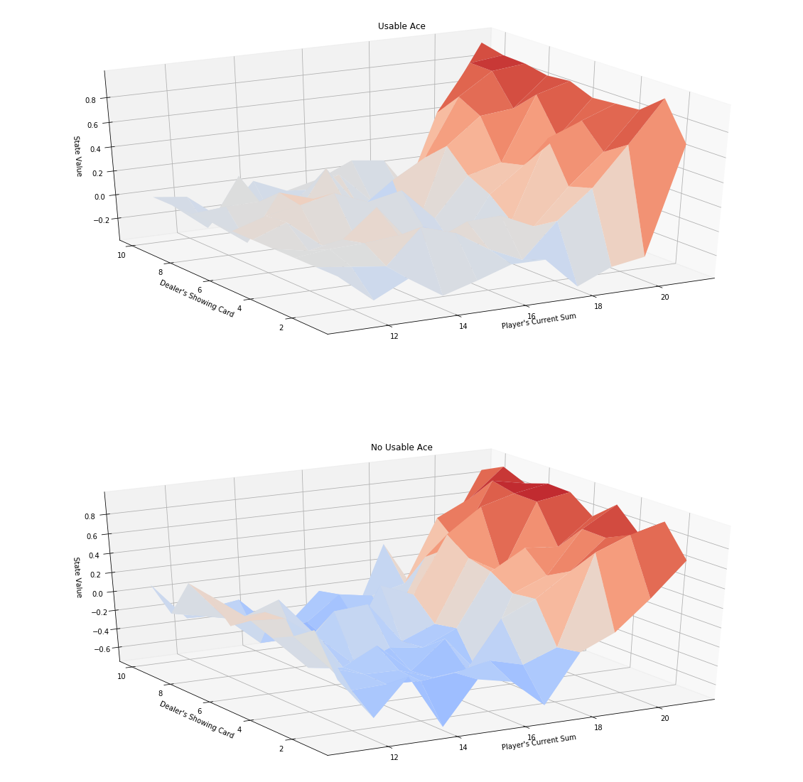
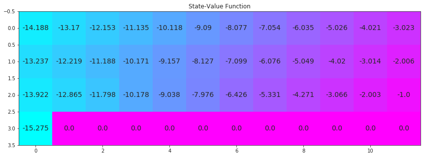

## Reinforcement Learning Excercise

This repository contains traditional (not using deep learning) reinforcement learning excercises as followings. This is a part of Udacity Deep Reinforcement Learning Nanodegree. 

 

- Monte Carlo / Epcilon-Greedy Methods (for Black Jack card game)
- Temporal Difference Methods (for Cliff-Walking-Environemnt)
    - SARSA
    - Q-Learning(SARSA-MAX)
    - Expected SARSA 
- Techniques for Continuous Spaces
    - Discretization
    - Tile Coding
    

  

### Some Results 

#### State-Values of Black Jack card game 

(image: pixabay)

- using Monte Carlo Method

- using Epcilon-Greedy Method

#### State Values of Cliff Walking

- using SARSA Expected Method

