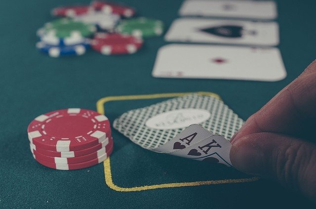

## Reinforcement Learning Excercise

This repository contains traditional (not using deep learning) reinforcement learning excercises as followings. This is a part of Udacity Deep Reinforcement Learning Nanodegree. 

 

- Monte Carlo / Epcilon-Greedy Methods (on Black Jack card game)
- Temporal Difference Methods (on Cliff-Walking-Environemnt)
    - SARSA
    - Q-Learning(SARSA-MAX)
    - Expected SARSA 
- Techniques for Continuous Spaces
    - Uniform Grid (on Mountain Car Environment https://gym.openai.com/envs/MountainCar-v0/)
    - Tile Coding (on Acrobot-v1 env. https://gym.openai.com/envs/Acrobot-v1/)
    

  

### Some Results 

#### State-Values of Black Jack card game 

(image: pixabay)

- using Monte Carlo Method

#### State Values of Cliff Walking

- using SARSA Expected Method

#### Q-Value and End Result of MountainCar Environment 

- using Uniform Grid preprocessing

  

#### Tile encoding

