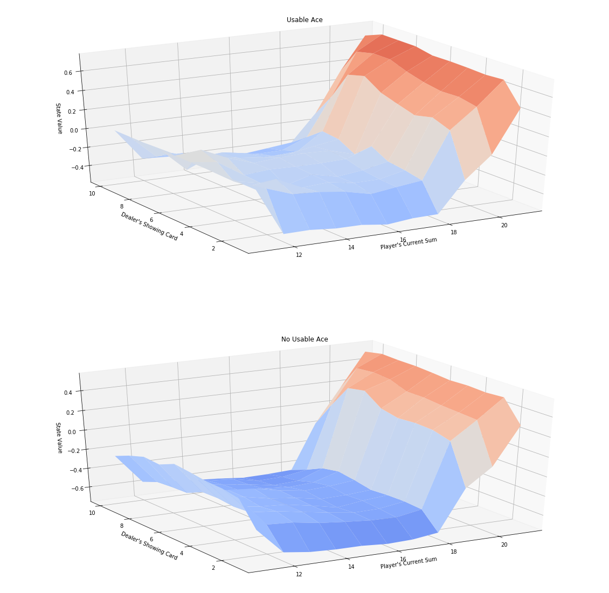

### Reinforcement Learning Excercise

This repository contains traditional (not using deep learning) reinforcement learning excercises as followings. This is a part of Udacity Deep Reinforcement Learning Nanodegree. 

- Monte Carlo Method
- Temporal Difference Method
- (OpenAI) Taxi Project
- Techniques for Continuous Spaces
    - Discretization
    - Tile Coding
    

#### Sample Images 

- Sate-Values of Monte Carlo Method (for Black Jack)

- State-Vlaues of Epsilon-Greedy Policy (for Black Jack)

